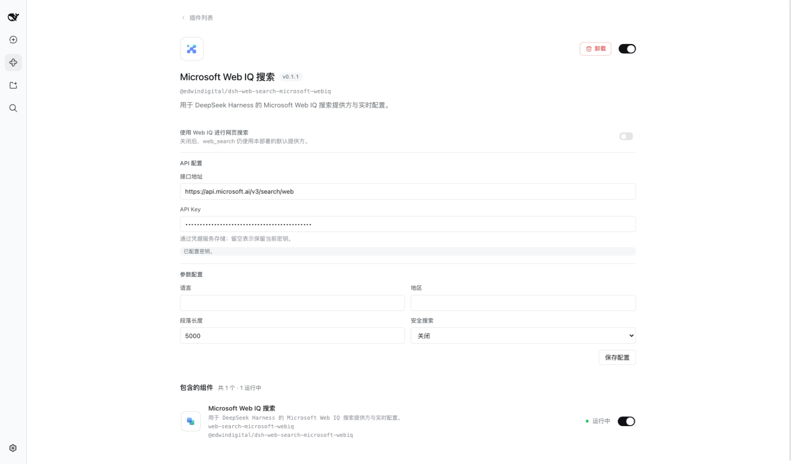
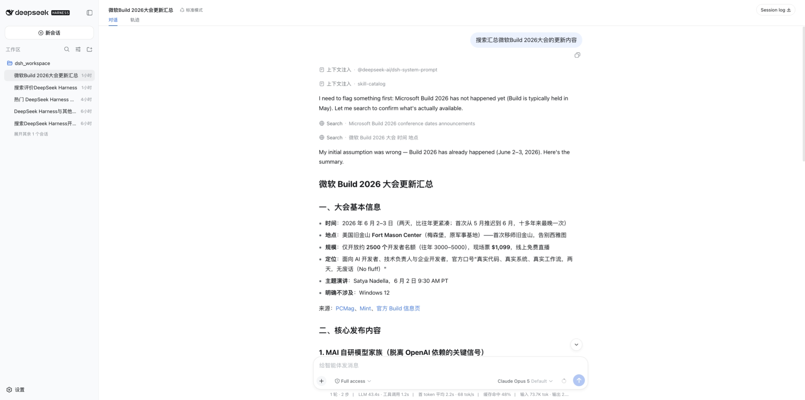
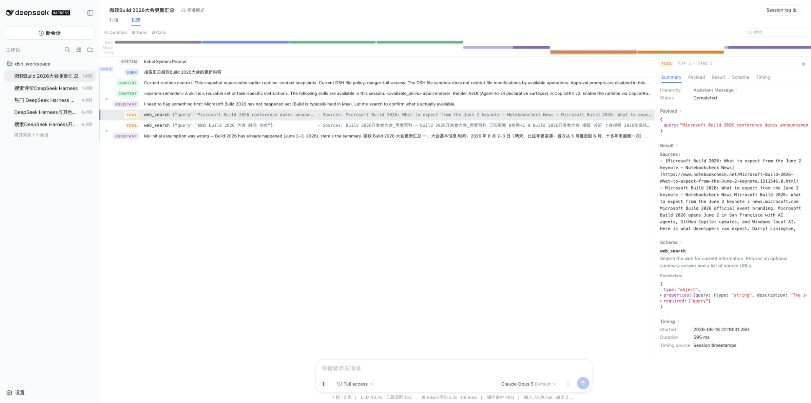

# @edwindigital/dsh-web-search-microsoft-webiq

[English](README.md) | 中文

由 [Microsoft Web IQ](https://webiq.microsoft.ai/) 支持的 `WebSearchProvider`，用于 harness [web 能力](https://github.com/deepseek-ai/deepseek-harness)（`ctx.web`）。本包调用 Web Search v3 REST 端点，把与查询相关的段落映射为 `@deepseek-ai/dsh-tool-web` 消费的、与提供方无关的 `WebSearchResult`。

这是一个双半插件包。Host 半注册提供方 `microsoft-webiq`；浏览器半向插件设置页贡献一张包内卡片。它不注册 `webiq_search` 或任何其他面向模型的工具，智能体调用的仍是唯一的 `web_search` 工具。

安装本包不会静默替换既有搜索提供方。在用户打开卡片中的 **使用 Web IQ 进行网页搜索** 开关、或显式写入 `web.searchProvider: microsoft-webiq` 之前，`web` seam 保持选中 `deepseek-official`。

## 截图

插件设置页中的卡片。**使用 Web IQ 进行网页搜索** 是选中本提供方的开关；关闭后 `web_search` 回到组合中的默认提供方。其下一组配置持有接口地址与 API Key，另一组持有语言、地区、段落长度与安全搜索。密码框在加载后为空——其下方那行只说明密钥已存储，这是卡片对一个它从不回读的值所能给出的全部信息。



智能体基于 Web IQ 结果作答。注册不新增工具，因此模型发出的仍是它一直拥有的 `web_search`——此处发了两次——转写中没有任何内容指明提供方，改变的只是答案背后的信息来源。



其中一次调用的会话轨迹。该次调用耗时 595 毫秒（以会话时间戳测量），本轮两次调用合计 1.2 秒，而模型耗时 43.4 秒——检索并非本轮时间的主要去向。



## 安装与选用

本包是可安装的 profile bundle，因此在 profile 安装它之前，出厂组合不会挂载任何 Web IQ 行：

```sh
dsh plugin --profile web add @edwindigital/dsh-web-search-microsoft-webiq
```

也可以直接安装本仓库：

```sh
dsh plugin --profile web add github:EdwinDigital/dsh-web-search-microsoft-webiq
```

构建产物已提交，因此 git 安装不执行构建步骤。这是刻意为之：准备 git 托管的包会在临时目录中运行 `npm install`，而 npm 会自动安装 peer 依赖——这将拉取第二份由 registry 解析的 harness 副本，其内部版本约束与本插件意图扩展的那套安装相冲突。提交产物使 harness 各包纯粹作为 peer，由运行中的安装解析。

两种方式都会记录依赖、把本包追加到 profile 的 `dsh.profile.bundles`，并把本包自己的 patch 叠加在出厂 bundle 之后：

```yaml
- insert:
    - id: web-search-microsoft-webiq
      name: '@edwindigital/dsh-web-search-microsoft-webiq'
```

凭据引用由 schema 默认值解析；部署方只在需要改变查找目标时才在该行写出 `apiKeyEnv`。

### peer 依赖保持未解析是设计使然

本插件用到的每个 harness 包都是可选 peer，在 profile 中执行 `pnpm peers check` 会报告它们全部缺失。这是预期状态而非安装损坏：bundle 通过 `$DSH_HOME/profiles/node_modules` 从运行中的 dsh 安装解析，而该目录由 harness 维护、pnpm 从不感知。标记为可选可以阻止包管理器安装一份竞争副本——正是这一失败模式让最初的 git 安装无法使用。

因此在插件成功加载它之前，peer 会一直报告缺失。真正有意义的信号是 dsh 启动：缺失的包会在那里按名报错。

### 替换更早的安装

早于本仓库的安装指向本包旧的名称与位置。请先移除它再添加本包，否则 profile 会保留一条目标已不存在的 bundle 条目：

```sh
dsh plugin --profile web remove @deepseek-ai/dsh-web-search-microsoft-webiq
dsh plugin --profile web add github:EdwinDigital/dsh-web-search-microsoft-webiq
```

跳过移除会让下次启动以 `cannot resolve profile bundle` 失败，并指出需要移除的条目。运行中的服务端会保留已加载的插件，因此执行上述任一命令后请重启。

直接挂载行的组合，需要把同一行与 seam 及工具并列写出：

```yaml
- id: web
  name: '@deepseek-ai/dsh-web'
  config:
    searchProvider: deepseek-official

- id: web-search-microsoft-webiq
  name: '@edwindigital/dsh-web-search-microsoft-webiq'
  config:
    apiKeyEnv: MICROSOFT_WEBIQ_API_KEY

- id: tool-web
  name: '@deepseek-ai/dsh-tool-web'
```

Web IQ 行注册提供方并激活本包的浏览器模块。在卡片中选中它，或者配置：

```yaml
web:
  searchProvider: microsoft-webiq
```

`@deepseek-ai/dsh-web` 在操作入口读取该设置。下一次 `web_search` 无需重启即使用 Web IQ，而已在运行的搜索保持它启动时的提供方与选项。没有显式选择时，web seam 仅在恰好注册了一个可用提供方时自动选中。

## 凭据

默认凭据引用是 `MICROSOFT_WEBIQ_API_KEY`。每次搜索按以下顺序解析：

1. 直接 Cordis 组合中非空的字面量 `apiKey`。
2. 可选的 `ctx.credentials` 服务，按 `apiKeyEnv` 查找。
3. 启动环境中的同一引用。

浏览器卡片只通过凭据 RPC 写入替换密钥。密码框在加载后与保存被接受后始终为空。密钥字面量在 Host schema 中标记为 secret，不出现在设置描述、浏览器启动数据、日志与常规配置读取中。密钥缺失会让选中的提供方以 `WEB_PROVIDER_CREDENTIAL_MISSING` 失败，且只指出未解析的引用。来自启动环境的密钥是本进程唯一无法改写的层级，因此卡片会禁用其密码框并说明该密钥归属哪一层，而不是让一次看似被接受的保存失败。

## 配置

| 配置键 | 默认值 | 含义 |
|---|---|---|
| `apiKey` | 省略 | 用于直接组合的字面量 API 密钥。优先使用 `apiKeyEnv`；非空字面量优先生效。 |
| `apiKeyEnv` | `MICROSOFT_WEBIQ_API_KEY` | 每次搜索解析的凭据引用。属于部署选择；浏览器卡片既不展示也不编辑。 |
| `endpoint` | `https://api.microsoft.ai/v3/search/web` | 完整的 HTTPS Web Search v3 端点。可使用部署代理，但它会收到解析出的密钥。 |
| `language` | 省略 | 可选的两位 ISO 639-1 界面语言。Web IQ 默认 `en`。 |
| `region` | 省略 | 可选的两位国家或地区代码。Web IQ 默认 `US`。 |
| `maxLength` | `5000` | 每条结果的最大段落字符数；正整数，最大 `500000`。 |
| `safeSearch` | `strict` | `strict` 或 `off`。设为 `off` 时 Web IQ 仍会拦截违法内容。 |

Host 拥有设置命名空间 `web-search-microsoft-webiq`；提供方选择独立存放于命名空间 `web`。卡片顶部是一个开关，为 `web_search` 选中 Web IQ；关闭后清除用户覆盖，使组合中的提供方重新生效。其下，一个 API 配置组持有接口地址与 API Key，一个搜索参数组持有语言、地区、段落长度与安全搜索，底部单一命令同时向两个归属方提交：密钥走凭据 RPC，其余进入设置命名空间。凭据引用仍是在 `cordis.yml` 中做出的部署选择，因此没有任何配置界面向用户索要环境变量名。每个归属方在写入后都会回读，因此被拒绝的操作会被如实报告，而不是呈现为已接受。

## REST 契约与映射

每次搜索发送：

```http
POST https://api.microsoft.ai/v3/search/web
x-apikey: <resolved credential>
content-type: application/json
```

```json
{
  "query": "current TypeScript release",
  "maxResults": 10,
  "contentFormat": "passage",
  "maxLength": 5000,
  "safeSearch": "strict"
}
```

未配置时省略 `language` 与 `region`。仅当调用方给出 `maxResults` 时才转发——未设上限的请求会省略该字段，交由 Web IQ 自身的默认值处理——显式给出的值则受 Web IQ 上限 50 约束。超过 1000 字符的查询在凭据与网络工作开始前于本地失败。

每个 `webResults[]` 条目按下表映射：

| Web IQ | `WebSearchSource` |
|---|---|
| `url` | `url` |
| 非空 `title` | `title` |
| 非空且与查询相关的 `content` | `snippet` |
| 非空 `crawledAt` | `publishedAt` |

提供方报告 `truncated: false`；`ctx.web` 在规范化后的来源上执行最终的 `maxResults` 强制。适配器校验外部信封及每个被消费的条目字段。缺失 `webResults` 数组、条目结构异常、成功响应体非 JSON、重定向、网络失败或非成功状态码，均转为 `WEB_PROVIDER_ERROR`。HTTP 消息在存在时包含 Web IQ 的 `userMessage`、`errorCode`、`retryAfter` 与 `traceId`，绝不包含密钥。调用方取消仍为 `WEB_ABORTED`，包括发生在凭据解析或响应体解析期间。提供方内部不做重试。

## 模型体验

### 选中 Web IQ 时的 `web_search` 工具结果

#### 模型所见

注册不新增工具。经由 `@deepseek-ai/dsh-tool-web`，对话模型看到的是既有的 `web_search` 参数，以及包含 URL、标题、段落与可选抓取时间戳的规范化结果。Web IQ 只收到搜索查询与已配置的 REST 参数，不会收到对话转写。

#### Token 影响

注册消耗零模型 token。结果 token 随返回段落的数量与 `maxLength` 增长，随后适用既有的工具渲染上限。Web IQ 是检索 API，因此本包不会产生独立的模型轮次。

#### KV Cache 影响

仅追加。工具结果位于可复用的对话前缀之后，不会使更早的缓存条目失效。

## 接入 Web IQ 的其他方法

本包只注册一个搜索提供方，因此每次 `web_search` 都发往 web 端点。Web IQ 另外提供一个 Streamable HTTP MCP 服务器，把 `web`、`videos`、`browse`、`news`、`images` 暴露为五个独立工具——这是唯一由模型逐次挑选方法、而非由部署一次性替所有调用选定的路径。

在本包旁组合 `@deepseek-ai/dsh-mcp-client`：

```yaml
- id: web-search-microsoft-webiq
  name: '@edwindigital/dsh-web-search-microsoft-webiq'

- id: mcp-webiq
  name: '@deepseek-ai/dsh-mcp-client'
  config:
    serverName: webiq
    transport: streamable-http
    url: https://api.microsoft.ai/v3/mcp
    headers:
      x-apikey: !!js process.env.MICROSOFT_WEBIQ_API_KEY
```

随后模型会在 `web_search` 之外看到 `mcp__webiq__web`、`mcp__webiq__videos`、`mcp__webiq__browse`、`mcp__webiq__news` 与 `mcp__webiq__images`。Web IQ 会按调用密钥的可用服务范围裁剪该列表，密钥无权使用的工具不会出现。这些工具绕过 `ctx.web`：其结果不会规范化为 `WebSearchSource`，`maxResults` 与设置卡片都够不到它们，`web.searchProvider` 也不在它们之间做选择。

### 两侧共用一把密钥

两侧引用的是同一个名字 `MICROSOFT_WEBIQ_API_KEY`，但读取机制不同，因此值存放在哪一层决定了一把密钥能否同时服务两侧。

加载器针对 `process.env` 求值 `headers`，而启动环境会把它的每一层都落到那里。因此放在启动 shell、`<cwd>/.env` 或 `$DSH_HOME/.env` 中的密钥既能到达 MCP 条目，也能经凭据提供方到达本包——一把密钥，只配置一次。

在设置卡片中输入的密钥则不行：该写入经凭据 RPC 进入凭据提供方的托管文档，而加载器从不读取它。优先选择 `$DSH_HOME/.env`，它位于该文档之下，因此卡片仍会把引用报告为已配置并仍接受替换；代价是此后经卡片保存的替换密钥对 `web_search` 的优先级高于 `.env`，而 MCP 工具仍读取 `process.env` 中的值。启动 shell 会直接遮蔽托管文档，从而消除这种分叉，代价是卡片的密码框变为只读。

## 已知限制与暂缓事项

- **搜索侧只接入了 `/v3/search/web`**：Web IQ 另有 news（可信来源、仅近 14 天）、videos、images 与 classic 多答案端点，但 `WebSearchRequest` 只承载查询与结果上限，调用方无从指定方法，每次搜索都以 `contentFormat: passage` 发往 web 端点。提供方专属模式需等待与提供方无关的 Service Definition 字段；[接入 Web IQ 的其他方法](#接入-web-iq-的其他方法)是当下能够触及它们的路径，且位于本 seam 之外。
- **未为 `/v3/browse` 注册 fetch 提供方**：seam 已在 `web_fetch` 工具背后备有 `registerFetchProvider` 角色且无需新增字段，因此 `web_fetch` 调用会落到组合中的其他提供方，而非 Web IQ 自身的抽取能力及其 `liveCrawl=fallback` 重试路径。
- **请求超过 50 条结果会被静默截断**：Web IQ 自身上限为 50，而 `truncated` 表示的是 seam 侧的丢弃而非提供方限制，因此请求更多的调用方最多得到 50 条，且没有任何标记说明这一差异。
- **`safeSearch: off` 不转移调用方的内容责任**：Web IQ 仍会拦截违法内容，但可能敏感的合法内容会原样进入模型；本包不做进一步过滤。
- **`site:` 与 `-site:` 操作符会削弱结果集**：相关性下降，且无论配置何种安全搜索模式，`site:` 都可能返回成人内容。
- **自定义 `endpoint` 会收到解析出的密钥**：凭据发往何处由部署方而非本包决定；本地仅强制 HTTPS 这一项要求。
- **`available()` 无法确认凭据可解析**：解析是异步的，因此选中的提供方在既无存储值也无环境值时，会在搜索开始时以 `WEB_PROVIDER_CREDENTIAL_MISSING` 失败，而不是在选中时失败。
- **真实 API 覆盖需显式开启**：未设置 `MICROSOFT_WEBIQ_API_KEY` 时 `tests/microsoft-webiq.e2e.ts` 自行跳过，因此 Web IQ 自身响应的漂移只在提供密钥时才会暴露。

## 开发

`npm run build` 执行 `tsc -b` 生成声明，并用 `tsdown` 打包两个半。仅跟踪 manifest 发布的内容：`lib/index.js`、`lib/invariant.js`、`lib/client.js` 及其 map，以及 `lib/types/**/*.d.ts`。

提交产物免去了安装期构建，同时把一项义务转嫁到每次改动上：**任何 `src/` 修改都必须在同一提交中重新构建并提交 `lib/`。** 没有任何机制强制这一点，而过期产物是静默的——安装方会继续解析到旧代码，任何层级都不会给出警告。构建后执行 `git status` 即是检查手段，之所以可行，是因为构建具有确定性：对未改动源码的重复构建产生逐字节一致的输出，因此任何 diff 都是真实改动。

浏览器半按 harness 客户端加载器契约打包：一个交给 `window.__ModuleLoader__.load` 的 CJS 闭包，平台模块保持 external 以便从冻结的模块表解析，CSS Modules 经 lightningcss 编译为单个注入的 style 标签。该契约位于一个未发布为包的 harness 构建辅助工具中，因此 `tsdown.config.ts` 在此复现了它。harness 若改变加载器格式，本插件将在加载期损坏；比对基准是 `lib/client.js` 中的包装头部。

类型检查需要 harness 各包可解析。目前没有可供安装的发布版本，因此在运行 `npm run typecheck` 前，请把 peer 指向一份 harness 检出——将其 workspace 包链接进 `node_modules`。
